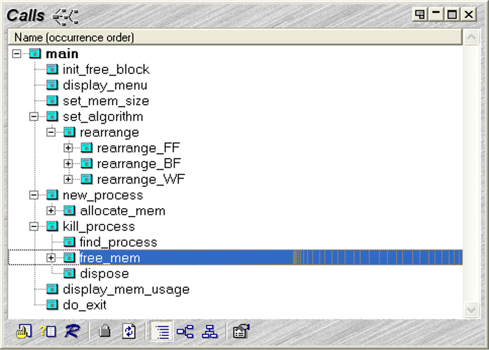

# 操作系统实验2

## 1.进程的软中断通信

#### 1.1实验目的

 编程实现进程的创建和软中断通信，通过观察、分析实验现象，深入理解进程及进程在调度执行和内存空间等方面的特点，掌握在**POSIX**规范中系统调用的功能和使用。 

#### 1.2 实验内容

**编制实现软中断通信的程序。**

使用系统调用fork()创建两个子进程，
用系统调用signal()让父进程捕捉键盘上发出的中断信号（即按delete键），当父进程接收到这两个软中断的某一个后，父进程用系统调用kill()向两个子进程分别发出整数值为16和17软中断信号。
子进程获得对应软中断信号，然后分别输出下列信息后终止：
​     Child process 1 is killed by parent !!  
​     Child process 2 is killed by parent !!  
父进程调用wait()函数等待两个子进程终止后，输入以下信息，结束进程执行：
​     Parent process is killed!! 

多运行几次编写的程序，简略分析出现不同结果的原因。

| 值   | 名字     | 说明                                         |
| ---- | -------- | -------------------------------------------- |
| 01   | SIGHUP   | 挂起                                         |
| 02   | SIGINT   | 中断，当用户从键盘键入“del”键时              |
| 03   | SIGQUIT  | 退出，当用户从键盘键入“quit”键时             |
| 04   | SIGILL   | 非法指令                                     |
| 05   | SIGTRAP  | 断点或跟踪指令                               |
| 06   | SIGIOT   | IOT指令                                      |
| 07   | SIGEMT   | EMT指令                                      |
| 08   | SIGFPE   | 浮点运算溢出                                 |
| 09   | SIGKILL  | 要求终止进程                                 |
| 10   | SIGBUS   | 总线错误                                     |
| 11   | SIGSEGV  | 段违例，即进程试图去访问其地址空间以外的地址 |
| 12   | SIGSYS   | 系统调用错                                   |
| 13   | SIGPIPE  | 向无读者的管道中写数据                       |
| 14   | SIGALARM | 闹钟                                         |
| 15   | SIGTERM  | 软件终止                                     |
| 16   | SIGUSR1  | 用户自定义信号                               |
| 17   | SIGUSR2  | 用户自定义信号                               |
| 18   | SIGCLD   | 子进程死                                     |
| 19   | SIGPWR   | 电源故障                                     |

程序流程图：

#### 1.3实验过程分析
代码补充完整，运行程序。或者多次运行，并且Delete/quit,键后，会出现什么结果？分析原因

如果程序运行，界面上显示“Child process 1 is killed by parent !!  Child process 2 is killed by parent !!”，五秒之后显示“Parent process is killed !!”，怎样修改程序使得只有接收到相应的中断信号后再发生跳转，执行输出？

将本实验中通信产生的中断通过14 号信号值进行闹钟中断，将signal(3,stop)当中数字信号变为2，体会不同中断的执行样式，从而对软中断机制有一个更好的理解。

## 回答下列问题，写入实验报告。
1. 你最初认为运行结果会怎么样？
2. 实际的结果什么样？有什么特点？试对产生该现象的原因进行分析。
3. kill 命令在程序中使用了几次？每次的作用是什么？执行后的现象是什么？
4. 使用kill 命令可以在进程的外部杀死进程。进程怎样能主动退出？这两种退出方式哪种更好一些？
5. 把程序源代码附到实验报告后

## 2.进程的管道通信

#### 2.1实验目的
编程实现进程的管道通信，通过观察、分析实验现象，深入理解进程管道通信的特点，掌握管道通信的同步和互斥机制。 

“管道”，是指用于连接一个读进程和一个写进程以实现他们之间通信的一个共享文件，又名pipe文件。向管道(共享文件)提供输入的发送进程(即写进程)，以字符流形式将大量的数据送入管道；而接受管道输出的接收进程(即读进程)，则从管道中接收(读)数据。由于发送进程和接收进程是利用管道进行通信的，故又称为管道通信。

管道通信程序流程图

猜想一下这个程序的运行结果。分析管道通信是怎样实现同步与互斥的，然后按照注释里的要求把代码补充完整，运行程序。 修改程序并运行，体会互斥锁的作用，比较有锁和无锁程序的运行结果，并解释之。

## 回答下列问题，写入实验报告。
1. 你最初认为运行结果会怎么样？
2. 实际的结果什么样？有什么特点？试对产生该现象的原因进行分析。
3. 实验中管道通信是怎样实现同步与互斥的？如果不控制同步与互斥会发生什么后果？
4.  把程序源代码附到实验报告后

## 3.内存分配与回收

通过深入理解内存分配管理的三种算法，定义相应的数据结构，编写具体代码。 充分模拟三种算法的实现过程，并通过对比，分析三种算法的优劣。

1）掌握内存分*F**B**W*策略及实现的思路

2）掌握内存回收过程及实现思路

3）参考给出的代码思路，实现内存的申请、释放的管理程序，调试运行，总结程序设计中出现的问题并找出原因，写出实验报告。

#### 3.1主要功能
1 - Set memory size (default=1024) /*设置内存的大小*/
2 - Select memory allocation algorithm /* 设置当前的分配算法 */
3 - New process /*创建新的进程，主要是获取内存的申请数量*/
4 - Terminate a process /*删除进程，归还分配的存储空间，并删除描述该进程内存分配的节点*/
5 - Display memory usage /* 显示当前内存的使用情况，包括空闲区的情况和已经分配的情况 */
0 - Exit

### 3.2 主要模块介绍

## 4.页面置换

模拟实现FIFO算法，LRU算法

#### 4.1 FIFO算法

##### 4.1.1 原理简述

在分配内存页面数（AP）小天进程页面数（PP）时，当然是最先运行的AP个页面放入内存；
这时又需要处理新的页面，则将原来放的内存中的AP个页中最先进入的调出（FIFO），再将新页面放入；
以后如果再有新页面需要调入，则都按上述规则进行。
算法特点：所使用的内存页面构成一个队列。

##### 4.1.2 实现逻辑

（1）初始化。设置两个数组page[ap]和pagecontrol[pp]分别表示进程页面数和内存分配的页面数，并产生一个随机数序列main[total_instruction]（这个序列由page[ap]的下标随机构成）表示待处理的进程页面顺序，diseffect置0。
（2）看main[]中是否有下一个元素，若有，就由main[]中获取该页面下标，并转（3），如果没有则转（7）。
（3）如果该页已在内存中，就转（2），否则转（4），同时未命中的diseffect加1。
（4）观察pagecontrol是否占满，如果占满则须将使用队列（在第（6）步中建立的）中最先进入的（就是队列的第一个单元）pagecontrol单元“清干净”，同时将page[]单元置为“不在内存中”。
（5） 将该page[]与pagecontrol[]建立对应关系（可以改变pagecontrol[]的标志位，也可以采用指针链接，总之至少要使对应的pagecontrol单元包含两个信息：一是它被使用了，二是哪个page[]单元使用的。page[]单元也包含两个信息：对应的pagecontrol单元号和本page[]单元已在内存中）。
 (6) 将用到的pagecontrol置入使用队列（这里的队列是一种FIFO的数据结构），返回（2）。
(7) 显示计算1-diseffect / total_instruction*100%，完成。

#### 4.2 LRU算法

##### 4.2.1 原理简述

当内存分配页面数（AP）小于进程页面数（PP）时，把最先执行的AP个页面放入内存。
当需调页面进入内存，而当前分配的内存页面全部不空闲时，选择将其中最长时间没有用到的那一页调出，以空出内存来放置新调入的页面（LRU）。
算法特点：每个页面都有属性来表示有多长时间未被CPU使用的信息。

##### 4.2.2 实现逻辑

(1) 初始化。设置两个数组page[ap]和pagecontrol[pp]分别表示进程页面数和内存分配的页面数，并产生一个随机数序列main[total_instruction]（这个序列由page[ap]的下标随机构成）表示待处理的进程页面顺序，diseffect置0。
(2) 看序列main[]中是否有下一个元素，如果有，就由main[]中获取该页面下标，并转（3），如果没有则转（6）。
(3) 如果该page[]单元在内存中便改变页面属性，使它保留“最近使用”的信息，转（2），否则转（4），同时diseffect加1。
(4) 看是否有空闲页面，如果有，就返回页面指针，并转到（5），否则，在内存页面中找出最长时间没有使用到的页面，将其“清干净”，并返回该页面指针。
(5) 在需处理的page[]与（4）中得到的pagecontrol[]之间建立联系，同时让对应的page[]单元保存“最新使用”的信息，转（2）。
        (6) 如果序列处理完成，就输出计算1-diseffect / total_instruction*100%的结果，完成

